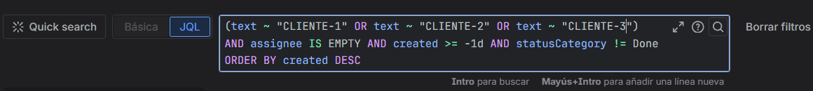
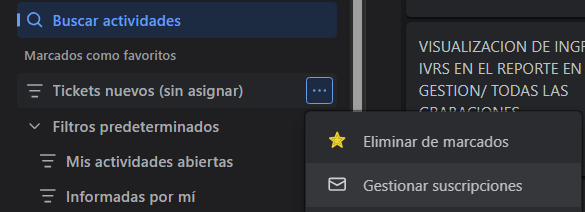
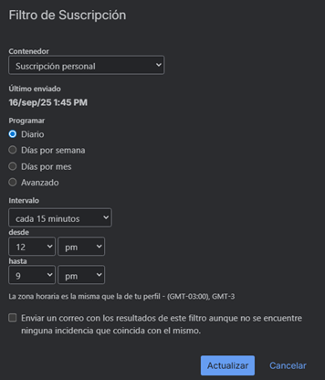
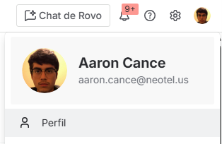

# Guía de configuración

Este documento explica cómo configurar el bot en **Google Apps Script** para que procese correos de Jira con tickets sin asignar.

---

## 📩 Configuración en Jira

1. Ir a [filtros de Jira](https://neotel-us.atlassian.net/jira/filters).  
2. Crear un filtro con búsqueda **JQL** y guardarlo con un nombre.  
   - Ejemplo: `Tickets nuevos (sin asignar)`

   

3. Crear la suscripción.

   
     
5. Añadir la suscripción con el intervalo deseado.

       

---

## 📧 Configuración en Gmail

5. En Gmail crea un filtro para esos correos: `jira-auto`.  
6. En el campo **Asunto** pon:  
  Suscripción [JIRA]: Tickets nuevos (sin asignar)
7. Verifica que el correo llegue con el filtro.

---

## 🔑 Credenciales de Atlassian

8. Crea un **API token** en Atlassian.  
9. Entra a [tu perfil](https://id.atlassian.com/manage-profile/profile-and-visibility).  
10. Entra a **Tokens de API** y crea uno.  
 - Ejemplo: `AppsScript-Jira-Auto`  
11. Guarda el token en un lugar seguro.  
12. Obtén tu **accountId de Jira** entrando a tu perfil.

     
  
13. Cópialo desde la URL generada, por ejemplo:  
 ```
 https://home.atlassian.com/o/a4de150/people/accountID?cloudId=
 ```

---

## ⚙️ Configuración en Google Apps Script

14. Ve a [Google Apps Script](https://script.google.com/home).  
15. Crea un **nuevo proyecto**.  
16. Entra a **Configuración de proyecto → Script properties** y pega tu token y `accountId`.  

| Property                    | Ejemplo                                       | Descripción |
|-----------------------------|-----------------------------------------------|-------------|
| `JIRA_BASE`                 | `https://tuorg.atlassian.net/`                | URL base de tu instancia de Jira |
| `JIRA_USER_EMAIL`           | `tu.email@empresa.com`                        | Correo Atlassian |
| `JIRA_API_TOKEN`            | `xxxxxxxx`                                    | Token de API de Atlassian |
| `JIRA_ASSIGNEE_ACCOUNT_ID`  | `xxxxxxxxxxxxxxxxxxxxxxxx`                    | AccountId del usuario asignado |
| `COMMENT_PUBLIC`            | `true`                                        | Habilitar comentario público |

17. Copia el código de [`src/Code.gs`](../src/Code.gs) en tu proyecto de Apps Script.  

---

## ⏱️ Crear trigger en Apps Script

18. En tu proyecto de Apps Script, ve a **Triggers** y crea uno:  
- Function: `checkJiraEmails`  
- Event source: **Time-driven**  
- Interval: cada 5–15 minutos (según tu necesidad).  

---
